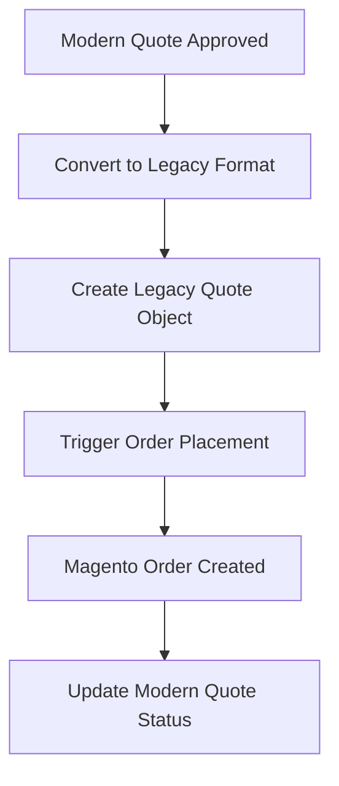

# Quote to Order Integration Guide

## Overview
This document details how approved quotes from the new `quotes` app will be converted to orders that can be placed through the existing Loome order management system.

## Integration Flow



## Data Mapping

### Quote Header Mapping
| Modern Quote Field | Legacy Quote.data Path | Notes |
|-------------------|------------------------|-------|
| subtotal | parsed_data.header.subtotal | Calculated field |
| tax_amount | parsed_data.header.tax_amount | Based on tax_rate |
| freight (calculated) | parsed_data.header.shipping_amount | From freight_amount/type |
| total | parsed_data.header.grand_total | All-inclusive total |
| quote_number | quote_number | Direct mapping |
| project | project | Direct relationship |

### Line Item Mapping
| Modern LineItem Field | Legacy Product Format | Notes |
|---------------------|----------------------|-------|
| part_number | sku | Direct mapping |
| quantity | qty | Convert to integer |
| sale_price | price | Unit price |
| cost | cost | Internal cost |
| manufacturer | vendor | Vendor name |
| description | description | Product description |
| extended_price | total_price | qty × price |
| total_cost | total_cost | qty × cost |

## Implementation Code

### 1. Quote Approval Handler
```python
# src/apps/quotes/services/order.py
from django.db import transaction
from apps.projects.models import Quote as LegacyQuote
from apps.quotes.models import ModernQuote

class QuoteOrderService:
    
    @transaction.atomic
    def approve_quote(self, modern_quote_id, user):
        """
        Approve a modern quote and prepare it for order placement
        """
        modern_quote = ModernQuote.objects.select_for_update().get(
            id=modern_quote_id
        )
        
        # Update modern quote status
        modern_quote.status = 'approved'
        modern_quote.approved_at = timezone.now()
        modern_quote.approved_by = user
        modern_quote.save()
        
        # Create legacy quote for order placement
        legacy_quote = self.create_legacy_quote(modern_quote)
        
        # Link the two quotes
        modern_quote.legacy_quote = legacy_quote
        modern_quote.save()
        
        return legacy_quote
    
    def create_legacy_quote(self, modern_quote):
        """
        Transform ModernQuote to legacy Quote format
        """
        # Build the data structure expected by existing system
        quote_data = {
            'parsed_data': {
                'header': self._build_header_data(modern_quote),
                'products': self._build_products_data(modern_quote),
            },
            'validation_errors': [],  # No errors for approved quotes
            'calcs': {
                'total_amount': float(modern_quote.total_cost),
                'margin_pct': float(modern_quote.margin_percent),
            }
        }
        
        # Create legacy quote
        legacy_quote = LegacyQuote.objects.create(
            project=modern_quote.project,
            quote_number=modern_quote.quote_number,
            data=quote_data,
            status=LegacyQuote.Status.APPROVED,
            quote_type='O',  # Original Package
            shipping_type=self._map_shipping_type(modern_quote),
            shipping_amt=modern_quote.freight_amount,
            is_active=True,
            approved_at=modern_quote.approved_at,
        )
        
        # Create QuoteItem objects for the legacy system
        self._create_legacy_items(legacy_quote, modern_quote)
        
        return legacy_quote
    
    def _build_header_data(self, modern_quote):
        """Build header data matching legacy format"""
        return {
            'project_name': modern_quote.project_name,
            'customer': modern_quote.organization.name,
            'quote_date': modern_quote.quote_date.isoformat(),
            'subtotal': float(modern_quote.subtotal),
            'tax_amount': float(modern_quote.tax_amount),
            'shipping_amount': float(modern_quote.get_shipping_amount()),
            'grand_total': float(modern_quote.total),
            'total_cost': float(modern_quote.total_cost),
        }
    
    def _build_products_data(self, modern_quote):
        """Build products array matching legacy format"""
        products = []
        for item in modern_quote.line_items.all():
            products.append({
                'sku': item.part_number,
                'qty': item.quantity,
                'price': float(item.sale_price),
                'cost': float(item.cost),
                'vendor': item.manufacturer,
                'description': item.description,
                'fixture_type': item.type,
                'total_price': float(item.extended_price),
                'total_cost': float(item.quantity * item.cost),
                'validation_errors': [],
            })
        return products
    
    def _create_legacy_items(self, legacy_quote, modern_quote):
        """Create QuoteItem objects for legacy system"""
        from apps.projects.models import QuoteItem
        
        for position, item in enumerate(modern_quote.line_items.all(), 1):
            QuoteItem.objects.create(
                quote=legacy_quote,
                position=position,
                sku=item.part_number,
                qty=item.quantity,
                unit_price=item.sale_price,
                unit_cost=item.cost,
                fixture_type=item.type,
                name=item.description,
                vendor_name=item.manufacturer,
                manufacturer=item.manufacturer,
                vendor_data={'source': 'modern_quote'},
                raw_import_data={
                    'modern_quote_id': modern_quote.id,
                    'line_item_id': item.id,
                },
            )
    
    def _map_shipping_type(self, modern_quote):
        """Map modern freight type to legacy shipping type"""
        if modern_quote.freight_type == 'percent':
            return LegacyQuote.ShipType.PCT
        elif modern_quote.freight_type == 'dollar':
            return LegacyQuote.ShipType.DLR
        else:
            return LegacyQuote.ShipType.NONE
```

### 2. Order Placement Integration
```python
# src/apps/quotes/views/quote.py
from apps.quotes.services.order import QuoteOrderService

class QuoteApprovalView(LoginRequiredMixin, View):
    """Handle quote approval and order preparation"""
    
    def post(self, request, pk):
        modern_quote = get_object_or_404(ModernQuote, pk=pk)
        
        # Check permissions
        if not request.user.has_perm('quotes.approve_quote'):
            return HttpResponseForbidden()
        
        # Approve quote and create legacy version
        service = QuoteOrderService()
        legacy_quote = service.approve_quote(modern_quote.id, request.user)
        
        # Redirect to order placement page
        return redirect('projects:order-place', 
                       project_id=legacy_quote.project.id,
                       quote_id=legacy_quote.id)
```

### 3. Status Synchronization
```python
# src/apps/quotes/receivers.py
from django.db.models.signals import post_save
from django.dispatch import receiver
from apps.projects.models import Quote as LegacyQuote

@receiver(post_save, sender=LegacyQuote)
def sync_quote_status(sender, instance, **kwargs):
    """
    When legacy quote status changes (e.g., to ORDERED),
    update the modern quote status
    """
    if hasattr(instance, 'modern_quote'):
        modern_quote = instance.modern_quote
        
        if instance.status == LegacyQuote.Status.ORDERED:
            modern_quote.status = 'ordered'
            modern_quote.order_placed_at = timezone.now()
            modern_quote.order_increment_id = instance.order_increment_id
            modern_quote.save()
```

## API Response Format

### Get Quote for Order Placement
```python
# Endpoint: GET /api/quotes/{id}/order-data/
{
    "quote_id": "Q-2501-A1B2C3",
    "project": {
        "id": 123,
        "name": "Sample Project",
        "address": {
            "street_1": "123 Main St",
            "city": "New York",
            "state": "NY",
            "zipcode": "10001"
        }
    },
    "customer": {
        "id": 456,
        "name": "ABC Company",
        "tax_exempt": false
    },
    "financial": {
        "subtotal": 10000.00,
        "tax_rate": 8.875,
        "tax_amount": 887.50,
        "freight_amount": 500.00,
        "total": 11387.50
    },
    "line_items": [
        {
            "sku": "LED-PANEL-2X4",
            "name": "LED Panel Light 2x4",
            "manufacturer": "Acme Lighting",
            "quantity": 10,
            "unit_price": 125.00,
            "extended_price": 1250.00,
            "unit_cost": 75.00,
            "total_cost": 750.00
        }
    ]
}
```

## Validation Rules

### Pre-Approval Checks
1. **Required Fields**
   - All line items must have valid SKUs
   - Quantities must be positive integers
   - Prices and costs must be positive numbers

2. **Address Validation**
   - Project must have complete shipping address
   - ZIP code required for tax calculation

3. **Financial Validation**
   - Subtotal must match sum of line items
   - Tax calculation must be verified
   - Total must equal subtotal + tax + freight

### Order Placement Checks
1. **Inventory Availability** (if applicable)
   - Check stock levels for each SKU
   - Flag any availability issues

2. **Credit Approval**
   - Verify customer credit status
   - Check credit limits

3. **Vendor Validation**
   - Ensure all vendors are active
   - Verify vendor SKUs exist

## Error Handling

### Common Scenarios
```python
class OrderConversionError(Exception):
    """Raised when quote cannot be converted to order"""
    pass

def handle_conversion_errors(modern_quote):
    """Validate quote before conversion"""
    errors = []
    
    # Check required fields
    if not modern_quote.project.address.get('street_1'):
        errors.append("Project missing shipping address")
    
    # Check line items
    if not modern_quote.line_items.exists():
        errors.append("Quote has no line items")
    
    # Check financial calculations
    calculated_total = (
        modern_quote.subtotal + 
        modern_quote.tax_amount + 
        modern_quote.get_shipping_amount()
    )
    if abs(calculated_total - modern_quote.total) > 0.01:
        errors.append("Total calculation mismatch")
    
    if errors:
        raise OrderConversionError("; ".join(errors))
```

## Testing Integration

### Test Scenarios
1. **Happy Path**
   - Create quote → Approve → Convert → Place order
   - Verify all data mapped correctly
   - Check status synchronization

2. **Edge Cases**
   - Quote with no freight
   - Tax-exempt customers
   - Multiple quote versions

3. **Error Cases**
   - Missing address
   - Invalid SKUs
   - Calculation mismatches

### Sample Test
```python
def test_quote_to_order_conversion():
    # Create modern quote
    modern_quote = ModernQuote.objects.create(
        project=project,
        organization=org,
        version_id='Q-2501-TEST01',
        subtotal=Decimal('1000.00'),
        tax_rate=Decimal('8.875'),
        tax_amount=Decimal('88.75'),
        freight_amount=Decimal('50.00'),
        freight_type='dollar',
        total=Decimal('1138.75'),
    )
    
    # Add line items
    LineItem.objects.create(
        quote=modern_quote,
        part_number='TEST-SKU',
        quantity=10,
        cost=Decimal('50.00'),
        sale_price=Decimal('100.00'),
        extended_price=Decimal('1000.00'),
    )
    
    # Convert to order
    service = QuoteOrderService()
    legacy_quote = service.create_legacy_quote(modern_quote)
    
    # Verify conversion
    assert legacy_quote.data['parsed_data']['header']['subtotal'] == 1000.00
    assert legacy_quote.data['parsed_data']['products'][0]['sku'] == 'TEST-SKU'
    assert legacy_quote.status == LegacyQuote.Status.APPROVED
```

## Rollback Strategy

If issues arise with the new system:

1. **Immediate Rollback**
   - Disable new quote creation
   - Revert to Google Sheets workflow
   - Approved quotes remain valid for orders

2. **Data Recovery**
   - All modern quotes preserved
   - Can manually convert if needed
   - Export functionality available

3. **Gradual Rollback**
   - Disable for specific projects only
   - Keep working quotes in new system
   - Return problem projects to old system